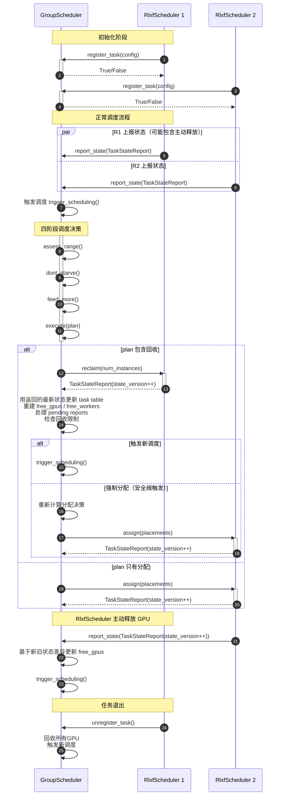

# GRPO GPU 集群调度器设计

## 1. 问题背景

GRPO（Group Relative Policy Optimization）多轮强化学习的推理阶段存在严重的长尾问题，导致GPU利用率低。多个任务运行在同一个集群时，需要一个全局调度器来：

1. 让多个任务时分复用公共GPU池
2. 分配粒度为 `tp * pp`（一个完整推理实例所需的卡数）
3. 接收任务上报指标，动态决定：
   - 从哪些任务回收多少张卡
   - 将回收的空闲卡分配给哪些任务

### 1.1 重要设计约束

1. **历史数据不确定性**：每个任务的历史平均每轮耗时、总耗时受到总卡数、并行策略等配置的影响，不一定能拿到准确值
2. **并行策略多样性**：每个任务的并行策略（tp/pp）不一样，但都是2的倍数
3. **拓扑感知**：一个tp组尽可能要放在同一台机器上，否则推理时延会非常高
4. **回收决策下放**：当中心调度器决策要回收某个任务的几张卡时，让任务本身来决定回收哪几张卡
5. **串行Actor模型**：调度器是单线程串行处理的，决策和执行调度时，其他所有任务上报的状态会被排队，下次触发调度时一次性把所有在队列中的上报信息更新到调度器的表中

### 1.2 核心不变量

```python
assert not (S_rem_i > 0 and K_i^idle > 0)
# 含义：任务自己会管理好实例，当还有剩余样本时不会让实例空闲。
# 如果这个条件不成立，任务不会上报状态，而是先给空闲实例分配样本
```

### 1.3 调度器落后问题

由于回收实例可能需要2～10秒左右，调度决策和执行之间存在延迟，任务状态可能在此期间发生变化（如从rollout进入train阶段）。

**核心解决方案**：
- 先执行回收（无法避免延迟）
- 回收完成后，**触发新的完整四阶段调度**（不继续当前调度的分配步骤）
- 下次调度自然使用刚回收的卡和最新状态

**辅助机制**：
1. 回收前轻量验证
2. 分批次小步调度
3. 分配前最终验证
4. 优先回收空闲实例
5. 所有任务状态都带单调递增的 `state_version`，调度器只接受最新版本

详见第7.1节详细设计。

---

## 2. 系统架构

### 2.1 组件概览

系统由两类Ray Actor组成：

1. **GroupScheduler**：全局调度器，单例
   - 维护集群状态和所有任务状态
   - 执行调度算法
   - 向任务发送Reclaim/Assign请求

2. **RlxfScheduler**：任务级调度器，每个任务一个
   - 管理该任务的推理实例
   - 向GroupScheduler上报状态
   - 接收并执行GroupScheduler的Reclaim/Assign请求

实现映射说明：issue #2 中提到的公开接口名是 `InferScheduler.revoke/assign`。本文继续沿用更抽象的 `RlxfScheduler` 命名，但接口语义以 issue #2 为准。

### 2.2 通信模式

```
RlxfScheduler ──ReportState──> GroupScheduler
                    (单向，无返回值)

GroupScheduler ──Reclaim/Assign──> RlxfScheduler
                    (主动推送)
```

**关键设计**：
- `report_state` 不返回调度决策，仅用于状态同步
- 调度决策由GroupScheduler在适当时机主动推送给任务
- `reclaim` / `assign` 执行完成后，任务会返回最新的 `TaskStateReport`
- 所有 `TaskStateReport` 都带 `state_version`，调度器丢弃旧版本状态，避免异步乱序覆盖新状态



---

## 3. 调度核心流程

每次触发调度会有以下四个阶段：

```python
delta_card_ranges = assess_range(task_states)
plan, excess_cards = dont_starve(delta_card_ranges)
if excess_cards:
    plan = feed_more(delta_card_ranges, plan, excess_cards)
execute(plan)
```

**关键点**：
- `assess_range`、`dont_starve`、`feed_more` 只计算**实例/卡数调整量**，不涉及具体GPU放置
- `execute` 阶段处理回收和分配
  - 如果有回收：执行回收 → 用返回的 `TaskStateReport` 更新任务表与 `free_gpus` → **触发新的完整调度**
  - 如果只有分配：直接执行分配，并用返回的 `TaskStateReport` 校正状态
- 调度由每次状态上报触发，但可能决策结果是不需要调整

### 3.1 符号定义

**任务级指标**：
- `T_i`：第i个任务
- `K_i^base`：任务i的固定分配基准实例数
- `K_i(t)`：时刻t任务i的实际实例数
- `K_i^idle(t)`：空闲实例数
- `K_i^busy(t)`：忙实例数（`K_i - K_i^idle`）
- `tp_i`：任务i的tensor parallelism（2的幂）
- `pp_i`：任务i的pipeline parallelism（2的幂）
- `cards_per_instance_i = tp_i * pp_i`：每个实例需要的卡数
- `S_rem_i`：剩余样本数

**集群状态**：
- `free_gpus`：调度器维护的空闲worker表，底层仍对应具体机器上的GPU
  - 逻辑格式：`[worker_id, ...]`
  - 拓扑元数据通过 `worker_id -> WorkerInfo(machine_id, gpu_id)` 查询

---

## 4. 阶段一：assess_range() - 评估增减范围

计算每个任务的GPU卡数调整范围。

```python
def assess_range(task_states):
    """
    计算每个任务的卡数调整范围 [min_cards, max_cards]

    返回:
      delta_card_ranges[i] = (min_cards, max_cards)
        - min_cards: 必须调整的卡数（负数表示必须回收，正数表示必须增加）
        - max_cards: 最多可以调整的卡数
    """
    delta_card_ranges = []

    for i in range(n_tasks):
        task = task_states[i]
        cards_per_instance = task.tp * task.pp
        current_cards = task.K_i * cards_per_instance
        max_total_cards = acceleration_limit_ratio * task.K_i_base * cards_per_instance

        # 情况0: 不在rollout阶段（包括刚注册还没开始的任务）→ 所有空闲实例都可以回收，且不再分配
        if not task.in_rollout_phase:
            min_cards = -task.K_i_idle * cards_per_instance
            max_cards = 0
            delta_card_ranges.append( (min_cards, max_cards) )

        # 情况1: 有剩余样本，但忙实例数没到基线 → 必须增加
        elif task.K_i_busy < task.K_i_base and task.S_rem_i > 0:
            min_cards = (catch_up_ratio * task.K_i_base - task.K_i_busy) * cards_per_instance
            max_cards = max_total_cards - current_cards
            delta_card_ranges.append( (min_cards, max_cards) )

        # 情况2: 有空闲实例，且没有剩余样本 → 必须回收（包括空闲实例和超额忙实例）
        elif task.S_rem_i == 0:
            must_reclaim_instances = task.K_i_idle
            if task.K_i_busy > task.K_i_base:
                must_reclaim_instances += (task.K_i_busy - task.K_i_base)
            min_cards = -must_reclaim_instances * cards_per_instance
            max_cards = 0
            delta_card_ranges.append( (min_cards, max_cards) )

        # 情况3: 忙实例数超过基线 → 可以回收超额部分
        elif task.K_i_busy > task.K_i_base:
            min_cards = -(task.K_i_busy - task.K_i_base) * cards_per_instance
            max_cards = max_total_cards - current_cards
            delta_card_ranges.append( (min_cards, max_cards) )

        # 情况4: 其他 → 不强制调整
        else:
            min_cards = 0
            max_cards = max_total_cards - current_cards
            delta_card_ranges.append( (min_cards, max_cards) )

    return delta_card_ranges
```

---

## 5. 阶段二：dont_starve() - 优先满足"没小康"的任务

优先满足所有 `min > 0` 的任务（也就是"没小康"的任务：有剩余样本但忙实例数没到基线）。

**回收优先级**：
1. 优先从本就空闲的卡中选
2. 如果没有空闲卡，先从"富得流油"的任务回收（`K_i^idle > 0`）
3. 再从"遥遥领先"的任务回收（`K_i^busy > K_i^base`）

**注意**：这一阶段只计算卡数，不做具体GPU放置。

```python
def dont_starve(delta_card_ranges):
    """
    优先满足min > 0的任务，生成初步plan

    返回:
      plan: 每个任务的卡数调整量（正数=增加，负数=回收）
      excess_cards: 富余的卡数（可以继续分配）
    """
    plan = [0] * n_tasks
    free_card_count = get_current_free_card_count()  # 只统计数量，不关心具体GPU

    # ---------- 第一步: 收集需求 ----------
    needy_tasks = []  # 需要增加卡的任务 (min > 0)
    reclaimable_tasks = []  # 可以回收卡的任务

    for i in range(n_tasks):
        min_cards, max_cards = delta_card_ranges[i]

        if min_cards > 0:
            needy_tasks.append( (i, min_cards) )
        elif min_cards < 0:
            # 可以回收，按优先级排序
            task = task_states[i]
            if task.K_i_idle > 0:
                priority = 0  # 最高优先级：有空闲实例
            else:
                priority = 1  # 次优先级：忙实例超基线
            reclaimable_cards = -min_cards
            reclaimable_tasks.append( (priority, reclaimable_cards, i) )

    # 按priority降序排序，其次按-reclaimable_cards升序排序（即按reclaimable_cards降序）
    reclaimable_tasks.sort(key=lambda x: (-x[0], -x[1]))

    # ---------- 第二步: 满足 needy_tasks ----------
    for (i, needed_cards) in needy_tasks:
        while needed_cards > 0:
            cards_per_instance = task_states[i].tp * task_states[i].pp

            # 先看有没有足够的空闲卡
            if free_card_count >= cards_per_instance:
                plan[i] += cards_per_instance
                free_card_count -= cards_per_instance
                needed_cards -= cards_per_instance
            else:
                # 需要回收
                if not reclaimable_tasks:
                    break

                priority, reclaimable_cards, j = reclaimable_tasks.pop()
                cards_per_instance_j = task_states[j].tp * task_states[j].pp

                # 回收一个实例
                reclaim_amount = min(reclaimable_cards, cards_per_instance_j)
                plan[j] -= reclaim_amount
                free_card_count += reclaim_amount

                # 如果还能回收，放回到队尾重新排序
                remaining = reclaimable_cards - reclaim_amount
                if remaining > 0:
                    reclaimable_tasks.append( (priority, remaining, j) )
                    reclaimable_tasks.sort(key=lambda x: (-x[0], -x[1]))

    # ---------- 第三步: 计算富余卡 ----------
    excess_cards = free_card_count

    return plan, excess_cards
```

---

## 6. 阶段三：feed_more() - 富余卡喂给收益最大的任务

如果 `excess_cards` 不为空，则选择收益最大的任务分发。issue #2 中收益函数已经改成基于“实例缺口指数 + 样本充足度指数”的组合评分，不再使用原来的线性打分。

**注意**：这一阶段同样只计算卡数，不做具体GPU放置。

```python
def feed_more(delta_card_ranges, plan, excess_cards):
    """
    把富余卡分配给收益最大的任务
    """
    # 计算每个任务的收益分
    task_scores = []
    for i in range(n_tasks):
        min_cards, max_cards = delta_card_ranges[i]
        task = task_states[i]

        # 跳过已经满足min的任务，或者不能再增加的任务
        if max_cards <= 0:
            continue

        # 计算收益分
        plan_num_instance = plan[i] // (task.tp * task.pp)
        score = compute_allocation_score(task, plan_num_instance)
        if score > 0:
            task_scores.append( (-score, i) )  # 负号用于降序

    # 按分数排序
    task_scores.sort()

    # 分配富余卡
    while excess_cards > 0 and task_scores:
        neg_score, i = task_scores.pop(0)
        task = task_states[i]
        cards_per_instance = task.tp * task.pp
        min_cards, max_cards = delta_card_ranges[i]

        # 检查上限
        current_cards = task.K_i * cards_per_instance + plan[i]
        max_allowed = task.K_i * cards_per_instance + max_cards
        if current_cards >= max_allowed:
            continue

        if excess_cards >= cards_per_instance:
            plan[i] += cards_per_instance
            excess_cards -= cards_per_instance

            # 如果还有收益，继续排队
            new_plan_num_instance = plan[i] // cards_per_instance
            new_score = compute_allocation_score(task, new_plan_num_instance)
            if new_score > 0:
                new_current = current_cards + cards_per_instance
                if new_current < max_allowed:
                    task_scores.append( (-new_score, i) )
                    task_scores.sort()

    return plan
```

### 6.1 收益评分函数

```python
def compute_allocation_score(task, plan_num_instance):
    """
    计算给任务分配实例的收益分数
    plan_num_instance: 当前调度plan中已经计划额外分给该任务的实例数
    """
    if not task.has_state:
        return 0

    # 在训练阶段，给实例没用
    if not task.in_rollout_phase:
        return 0

    # 没有剩余样本了
    if task.S_rem_i <= 0:
        return 0

    # 基准实例数为0时直接返回0（避免除0错误）
    if task.K_i_base <= 0:
        return 0

    weight_instances = 40
    weight_samples = 60

    score = 0

    # 假设当前实例数（包含计划实例）
    assumed_num_instance = plan_num_instance + task.K_i

    # issue #2: 合并原来的信号1和信号2，改为指数实例平衡信号
    deficit = task.K_i_base - assumed_num_instance
    score += weight_instances * math.exp(deficit / task.K_i_base)

    # issue #2: 用 remaining_samples / busy_instances 近似估计尾部完成时间
    if task.K_i_busy > 0:
        remaining_ratio = task.S_rem_i / task.K_i_busy
    else:
        remaining_ratio = task.S_rem_i * 5

    total_ratio = task.total_samples / task.K_i_base
    sample_sufficiency = remaining_ratio / total_ratio
    score += weight_samples * math.exp(sample_sufficiency - 1.0)

    return score
```

**说明**：
- 这里显式采用 issue #2 的实现口径：实例平衡信号与忙碌比例不再分开计算，而是一起折叠进 `exp(deficit / base_instances)`。
- `remaining_samples / busy_instances` 不是精确剩余时间预测，而是一个只依赖当前可观测状态的 proxy，用来判断“再给实例是否还有足够工作量”。

---

## 7. 阶段四：execute() - 执行plan

**关键洞察**：调度主要时间花在回收上（2～10秒左右），而非计算决策。因此：

1. **如果plan包含回收**：检查是否达到回收限制 → 执行回收 → 用返回的 `TaskStateReport` 更新状态 → 决定是触发新调度还是继续做分配
2. **如果plan只有分配**：直接执行分配，并用返回的 `TaskStateReport` 做最终状态校正

**回收限制**（安全阀）：
- 连续回收次数超过 `max_consecutive_reclaims`（默认3），强制做分配
- 空闲GPU比例超过 `max_free_gpu_ratio`（默认0.3），强制做分配

```python
def execute(plan):
    """
    执行调度plan

    分两种情况：
    1. 有回收：执行回收，然后根据回收限制决定是触发新调度还是继续做分配
    2. 只有分配：直接执行分配
    """
    # ---------- 第一步: 判断是否有回收 ----------
    has_reclaim = any(p < 0 for p in plan)
    has_assign = any(p > 0 for p in plan)

    if has_reclaim:
        # ---------- 情况A: 有回收 ----------
        # 收集要回收的任务
        reclaim_tasks = []
        for i in range(n_tasks):
            if plan[i] < 0:
                task = task_states[i]
                # 回收前验证：确保仍有可回收的实例
                if task.K_i_idle > 0 or task.K_i_busy > task.K_i_base:
                    cards_to_reclaim = -plan[i]
                    instances_to_reclaim = cards_to_reclaim // (task.tp * task.pp)
                    reclaim_tasks.append( (i, instances_to_reclaim) )

        # 并发发送回收请求，等待全部完成
        # 这是最耗时的步骤（2～10秒左右）
        reclaim_reports = concurrent_reclaim(reclaim_tasks, timeout_sec=60.0)

        # 用返回的最新 TaskStateReport 校正任务状态与 free_gpus
        for report in reclaim_reports:
            apply_task_state_report(report)

        # 处理排队的状态更新
        process_pending_state_reports()

        # 更新连续回收计数器
        consecutive_reclaim_count += 1

        # ---------- 检查回收限制，决定下一步 ----------
        free_gpu_ratio = len(free_gpus) / total_gpus
        force_assign = (
            consecutive_reclaim_count >= max_consecutive_reclaims
            or free_gpu_ratio >= max_free_gpu_ratio
        )

        if force_assign:
            # ---------- 安全阀触发：强制做分配，不触发新调度 ----------
            # 重置连续回收计数器
            consecutive_reclaim_count = 0

            # 基于最新状态重新计算分配决策
            delta_card_ranges = assess_range(task_states)
            assign_plan, excess_cards = dont_starve(delta_card_ranges)
            if excess_cards:
                assign_plan = feed_more(delta_card_ranges, assign_plan, excess_cards)

            # 执行分配（复用情况B的逻辑）
            do_assign(assign_plan)
        else:
            # ---------- 正常情况：触发新的完整调度 ----------
            trigger_scheduling()
        return

    if has_assign:
        # ---------- 情况B: 只有分配，直接执行 ----------
        # 重置连续回收计数器
        consecutive_reclaim_count = 0
        do_assign(plan)


def do_assign(plan):
    """
    执行分配（被情况A的强制分配和情况B复用）
    """
    # 收集分配需求
    allocation_requests = []
    for i in range(n_tasks):
        if plan[i] > 0:
            task = task_states[i]
            # 验证：必须在rollout阶段且有剩余样本
            if task.in_rollout_phase and task.S_rem_i > 0:
                cards_to_allocate = plan[i]
                instances_to_allocate = cards_to_allocate // (task.tp * task.pp)
                allocation_requests.append( (i, instances_to_allocate) )

    # 全局优化放置
    placements = find_best_placement_global(allocation_requests)

    # 并发发送分配请求，并使用任务返回的新状态做校正
    assign_reports = concurrent_assign(placements)
    for report in assign_reports:
        apply_task_state_report(report)
```

其中 `apply_task_state_report(report)` 的语义是：
1. 若 `report.state_version <= last_state_version[task_id]`，丢弃该状态
2. 否则覆盖任务最新状态
3. 基于 `assigned_workers` 的新旧差异，重建该任务占有的资源集合
4. 将差异同步到 `free_gpus` / `free_workers`

**为什么这样设计**：
- 架构清晰：不破坏原来的四阶段流程
- 避免递归：正常情况用 `trigger_scheduling()` 触发新调度
- 状态新鲜：下次调度自然会用上刚回收的卡和最新状态
- **安全阀机制**：避免连续回收太多次或持有太多空闲GPU
- 避免"回收期间任务从needy变成train，但仍按旧plan分配"的问题

### 7.1 调度器落后问题的缓解策略

由于回收实例可能需要2～10秒左右，任务状态可能在调度期间发生变化。无法完全杜绝调度器落后，但通过以下机制减少影响：

### 7.2 实例启动开销说明

把实例assign给各个任务后，各项准备（启动torch、初始化驱动、加载权重、分配kv cache pool）直到可以工作大概需要60秒，但这个不算在调度的开销中。当前的流程设计可以应对这种级别的开销，启动开销虽然很高，但和这里的调度逻辑没有关系，是可以独立优化的。

#### 核心策略：回收后触发新调度

这是最有效的策略（见第7节`execute()`）：
1. 先执行回收（这部分无法避免延迟）
2. 回收完成后，处理所有排队的状态更新，只接受最新 `state_version`，并更新 `free_gpus`
3. **触发新的完整四阶段调度**（而不是在当前流程里继续做分配）
4. 下次调度基于最新状态和刚回收的卡重新决策

**为什么有效**：
- 架构清晰：不破坏原来的四阶段流程，没有内部递归
- 决策是基于最新状态做的，不是回收前的旧状态
- 避免了"回收期间任务从needy变成train，但仍按旧plan分配"的问题

#### 辅助策略1：回收前轻量验证

```python
# 在execute()中使用
for i in range(n_tasks):
    if plan[i] < 0:
        task = task_states[i]
        # 只做最基本的检查：确保仍有可回收的实例
        if task.K_i_idle > 0 or task.K_i_busy > task.K_i_base:
            reclaim_tasks.append( (i, instances_to_reclaim) )
```

#### 辅助策略2：分批次小步调度

每次调度只处理有限数量的回收，避免单次回收耗时过长：

```python
MAX_INSTANCES_TO_RECLAIM_PER_SCHEDULE = 8  # 每次最多回收8个实例
```

#### 辅助策略3：分配前最终验证

即使只有分配，执行前也要验证：
- 必须仍在 `in_rollout_phase`
- 必须仍有 `S_rem_i > 0`

#### 辅助策略4：回收限制安全阀

避免连续回收太多次或持有太多空闲GPU：

```python
# 连续回收计数器（调度器状态变量
consecutive_reclaim_count = 0

# 每次只分配后重置，每次回收后递增
```

触发强制分配的条件：
1. `consecutive_reclaim_count >= max_consecutive_reclaims`（默认3）
2. `len(free_gpus) / total_gpus >= max_free_gpu_ratio`（默认0.3）

满足任一条件则：
- 重置 `consecutive_reclaim_count = 0`
- 在当前调度里继续做分配（不触发新调度）

#### 辅助策略5：优先回收空闲实例

回收时优先回收 `K_i^idle > 0` 的任务：
- 这些任务即使进入train阶段，回收空闲实例的影响也较小
- 空闲实例的回收通常更快（不需要等待当前推理完成）

---

## 8. 拓扑感知放置（全局优化版）

### 8.1 问题定义

这是一个全局优化问题：给定一批分配需求（每个任务需要若干个`tp*pp`大小的实例），以及空闲worker池，找到拓扑最优的放置方案。

**优化目标**：
1. 最大化同一TP组内GPU的同机率
2. 最小化跨机器通信
3. 尽量减少GPU碎片化

### 8.2 全局放置算法

```python
def find_best_placement_global(allocation_requests):
    """
    全局优化GPU放置

    allocation_requests: [(task_id, num_instances), ...]
    free_by_machine: {machine_id: [worker_id, worker_id ...], ...}

    返回: [(task_id, [placement1, placement2, ...]), ...]
           其中每个placement是[worker_id, ...]，长度为tp*pp
    """
    placements = []
    used_gpus = set()
    free_by_machine = self.workers.idle_workers_per_machine
    left_allocation_requests = []

    # 第一轮：优先单机器放置
    for (task_id, num_instances) in allocation_requests:
        task = self.tasks.get_task(task_id)
        worker_per_instance = task.tp * task.pp
        instance_placements = []

        for _ in range(num_instances):
            # 找有足够GPU的机器
            for machine_id in free_by_machine:
                available = [worker_id for worker_id in free_by_machine[machine_id]
                             if worker_id not in used_gpus]
                if len(available) >= worker_per_instance:
                    # 选择这个机器
                    selected_gpus = available[:worker_per_instance]
                    instance_placements.append(selected_gpus)
                    used_gpus.update(selected_gpus)
                    break
            else:
                left_allocation_requests.append(
                    (task_id, num_instances - len(instance_placements))
                )
                break

        placements.append( (task_id, instance_placements) )

    # 第二轮：处理剩余的跨机器放置
    # TODO: 改进为启发式算法，尽量减少GPU碎片化
    start = 0
    left_idle_workers = [
        worker_id
        for worker_id in self.workers.idle_workers
        if worker_id not in used_gpus
    ]
    for (task_id, num_instances) in left_allocation_requests:
        task = self.tasks.get_task(task_id)
        worker_per_instance = task.tp * task.pp
        instance_placements = []
        for _ in range(num_instances):
            if start + worker_per_instance > len(left_idle_workers):
                break
            selected_gpus = left_idle_workers[start:start + worker_per_instance]
            start += worker_per_instance
            instance_placements.append(selected_gpus)
        placements.append( (task_id, instance_placements) )

    return placements
```

**说明**：
- 这里按 issue #2 采用“先尽量单机凑满一个实例，再对剩余 worker 直接切片”的两阶段策略。
- 当前第二轮仍是朴素枚举，没有启发式碎片整理；这一点保留为后续优化项。

---

## 9. 数据结构与接口定义

### 9.1 Worker / GPU位置信息

```python
@dataclass
class WorkerInfo:
    worker_id: str
    gpu_id: int
    machine_id: int
```

### 9.2 任务配置

```python
@dataclass
class TaskConfig:
    task_id: str
    base_instances: int
    tp: int
    pp: int
    samples_per_round: int
    total_samples: int
```

### 9.3 任务状态上报

```python
@dataclass
class TaskStateReport:
    task_id: str
    state_version: int  # 单调递增，只接受最新状态

    # 进度
    done_samples: int
    done_rounds: int
    elapsed_time_sec: float
    remaining_samples: int

    # 当前分配
    current_instances: int
    idle_instances: int
    busy_instances: int

    # 阶段
    in_rollout_phase: bool

    # 当前持有资源的完整快照
    assigned_workers: List[WorkerInfo]
    idle_worker_ids: List[str]
```

### 9.4 调度决策：为单个任务的分配

```python
@dataclass
class TaskAllocation:
    task_id: str
    instance_delta: int  # 正数=增加，负数=回收，0=不变
    recommended_workers: List[WorkerInfo]  # 只有分配时会填，回收时不会填
```

### 9.5 调度决策

```python
@dataclass
class SchedulingDecision:
    allocations: List[TaskAllocation]
    timestamp_sec: float
```

### 9.6 GroupScheduler Actor 接口

```python
class GroupScheduler:
    def register_task(self, config: TaskConfig) -> bool:
        """
        注册新任务

        返回: True表示注册成功，False表示资源不足被拒绝
        准入检查：计算所有实例的基线卡数之和是否小于等于池子里的总卡数
        """
        pass

    def report_state(self, report: TaskStateReport) -> None:
        """
        任务上报状态（无返回值）
        状态更新会被排队，下次调度时统一处理
        如果report.state_version不是最新版本，则丢弃
        调度器通过对比assigned_workers的新旧差异更新free_gpus / free_workers
        """
        pass

    def unregister_task(self, task_id: str) -> None:
        """任务注销"""
        pass
```

### 9.7 RlxfScheduler Actor 接口

```python
class RlxfScheduler:
    def reclaim(self, num_instances: int) -> TaskStateReport:
        """
        回收指定数量的实例
        任务必须服从，不能拒绝
        返回执行后的最新TaskStateReport
        """
        pass

    def assign(self, placements: List[List[str]]) -> TaskStateReport:
        """
        分配新实例
        placements: 每个实例的worker_id列表
        任务必须服从，不能拒绝
        返回执行后的最新TaskStateReport
        """
        pass
```

---

## 10. 调优参数

| 参数名 | 推荐初始值 | 说明 |
|--------|-----------|------|
| `catch_up_ratio` | 1.2 | `assess_range` 阶段使用：给落后任务多一些卡让它赶上进度（min_cards 计算） |
| `acceleration_limit_ratio` | 1.5 | `feed_more` 阶段使用：控制不给某个可加速任务分配太多卡 |
| `max_consecutive_reclaims` | 3 | 最大连续回收次数，超过后强制做一次分配 |
| `max_free_gpu_ratio` | 0.3 | 最大空闲GPU比例（0-1），超过后强制做一次分配 |

### 10.1 回收限制条件的必要性分析

两个条件**都有必要**，它们是互补的：

#### 条件1：`max_consecutive_reclaims` - 进度保证

**解决的问题**：调度器"转圈"但没进展

**场景**：
- 每次只回收一点点，触发新调度后又发现有新的可回收任务
- 虽然 `sum(K_i^base) <= total_gpus`，但任务状态在频繁变化
- 导致永远在回收，永远不分配

**为什么必要**：
- 即使 `max_free_gpu_ratio` 存在，也可能每次只回收一点，永远达不到比例阈值
- 这是一个**"进度"**保证，确保调度器不会无限循环

---

#### 条件2：`max_free_gpu_ratio` - 资源利用率保证

**解决的问题**：有卡不用

**场景**：
- 回收太激进，连续回收2次就已经持有30%空闲卡了
- 但还没达到 `max_consecutive_reclaims=3`，所以还在继续回收

**为什么必要**：
- 即使 `max_consecutive_reclaims` 存在，也可能在达到次数限制前已经持有太多空闲卡
- 这是一个**"资源利用率"**保证，避免浪费

---

#### 互补性验证

| 只有连续回收次数 | 只有空闲卡比例 | 两个都有 |
|---|---|---|
| ❌ 可能持有过多空闲卡 | ❌ 可能每次只回收一点，永远达不到阈值 | ✅ 既保证进度，又保证利用率 |

---

## 11. 边界情况处理

**新任务加入**：
- 准入检查：计算所有任务（包括新任务）的基线卡数之和 `sum(K_i^base * tp_i * pp_i)` 是否小于等于集群总卡数
- 如果超过则拒绝register请求
- 注册成功后，**暂不分配任何GPU**
- 等待任务首次上报 `in_rollout_phase = True` 时才开始分配

**任务退出**：
- 回收该任务的所有GPU，更新 `free_gpus` 表
- 重新触发一次调度

**GPU不足以满足所有 needy_tasks**：
- 按任务提交顺序或者优先级分配

**RlxfScheduler 主动释放GPU**：
- 当任务进入train阶段或不再需要某些实例时，直接上报一个更新后的 `TaskStateReport(state_version++)`
- 调度器通过比较新旧 `assigned_workers` 差异识别释放出的GPU，并更新 `free_gpus`
- 更新成功后触发一次调度

---

## 12. 可观测性

### 12.1 调度器级别指标（时间序列）

| 指标名 | 类型 | 说明 |
|--------|------|------|
| `scheduler.trigger_count` | Counter | 调度触发次数 |
| `scheduler.decision_count` | Counter | 产生实际调整的决策次数 |
| `scheduler.execution_duration_seconds` | Histogram | 单次调度执行耗时 |
| `scheduler.queue_pending_reports` | Gauge | 排队等待的状态报告数量 |
| `scheduler.consecutive_reclaim_count` | Gauge | 当前连续回收次数 |
| `scheduler.force_assign_count` | Counter | 安全阀触发强制分配的次数 |
| `scheduler.stale_report_drop_count` | Counter | 因 `state_version` 过旧被丢弃的状态数 |
| `cluster.gpu_total` | Gauge | 集群总GPU数 |
| `cluster.gpu_free` | Gauge | 空闲GPU数 |
| `cluster.gpu_free_ratio` | Gauge | 空闲GPU比例（0-1） |
| `cluster.gpu_utilization` | Gauge | GPU利用率（0-1） |
| `cluster.fragmentation_score` | Gauge | GPU碎片化分数（0-1，越高越碎） |
| `task.count` | Gauge | 当前活跃任务数 |
| `task.needy_count` | Gauge | needy_tasks数量 |

### 12.2 任务级别指标（时间序列，带task_id标签）

| 指标名 | 类型 | 说明 |
|--------|------|------|
| `task.instances.total` | Gauge | 总实例数 |
| `task.instances.busy` | Gauge | 忙实例数 |
| `task.instances.idle` | Gauge | 空闲实例数 |
| `task.instances.base` | Gauge | 基准实例数 |
| `task.samples.remaining` | Gauge | 剩余样本数 |
| `task.samples.done` | Counter | 已完成样本数 |
| `task.rollout_phase` | Gauge | 是否在rollout阶段（0/1） |
| `task.allocation_changes` | Counter | 分配调整次数 |
| `task.reclaim_count` | Counter | 被回收次数 |
| `task.assign_count` | Counter | 被分配次数 |
| `task.voluntary_reclaim_count` | Counter | 主动释放次数 |

### 12.3 调度决策日志（每决策一条）

每次调度决策记录以下结构化日志：

```python
@dataclass
class SchedulingTrace:
    trace_id: str
    timestamp_sec: float
    duration_sec: float

    # 触发原因
    trigger_type: str  # "state_report", "task_register", "task_unregister", "voluntary_reclaim", "manual"

    # 回收限制状态
    consecutive_reclaim_count_before: int  # 调度前的连续回收次数
    forced_assign: bool  # 是否触发了强制分配
    forced_assign_reason: str  # 强制分配的原因："consecutive_reclaims" / "free_gpu_ratio" / ""

    # 调度前状态快照
    pre_snapshot: ClusterSnapshot

    # 调度决策
    plan: List[TaskAllocation]

    # 调度后状态快照
    post_snapshot: ClusterSnapshot

    # 各阶段耗时
    phase_durations: Dict[str, float]  # {"assess_range": 0.001, "dont_starve": 0.002, ...}

@dataclass
class ClusterSnapshot:
    free_gpus: List[WorkerInfo]
    task_states: List[TaskState]
```

### 12.4 GPU分配历史（每次分配/回收一条）

```python
@dataclass
class GPUAllocationEvent:
    event_id: str
    timestamp_sec: float
    task_id: str
    event_type: str  # "assign", "reclaim", "voluntary_reclaim"
    instance_count: int
    workers: List[WorkerInfo]
    reason: str  # "dont_starve", "feed_more", "task_exit", "voluntary", etc.
```

---

## 13. 遗留问题

### 13.1 任务异常与超时处理

当前设计假设任务Agent不会异常或超时，实际工程中需要考虑：

- 任务Agent崩溃/重启后的状态恢复
- Reclaim/Assign请求的超时机制（第7.1节已有部分设计）
- 任务无响应时的强制回收策略
- 任务上报异常数据的检测和处理

### 13.2 调度器落后问题的进一步优化

第7.1节已设计了基本缓解机制，但仍可优化：

- 预测任务状态变化趋势，提前调整决策
- 根据历史数据动态调整调度频率和批次大小
- 设计更优雅的回滚/补偿机制，而非简单跳过

### 13.3 GPU碎片化整理

当前设计没有碎片化整理机制：

- 长时间运行后GPU可能严重碎片化
- 需要设计GPU迁移/整理策略
- 迁移会影响任务性能，需要权衡

### 13.4 拓扑放置算法优化

当前的全局放置算法是启发式的：

- 可以考虑更优的组合优化算法（如整数规划）
- 对于大规模集群，需要考虑算法复杂度
- 可能需要机器学习辅助的放置策略
